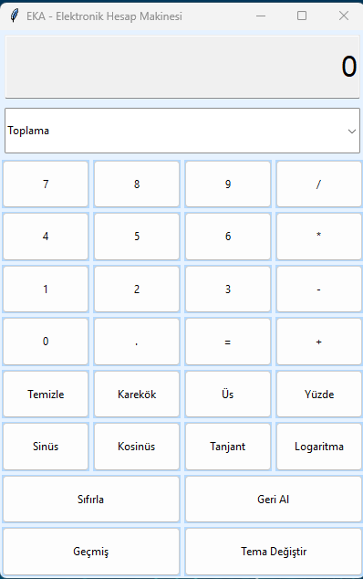

# HesapMakinesi

EKA - Elektronik Hesap Makinesi, basit matematiksel işlemlerden karmaşık bilimsel hesaplamalara kadar geniş bir yelpazede işlev sunan, kullanıcı dostu bir masaüstü uygulamasıdır. Bu projede, Python ve Tkinter kullanarak bir hesap makinesi arayüzü oluşturulmuş, temalar ve işlem geçmişi gibi ek özellikler dahil edilmiştir.

## Özellikler

- **Temel Matematiksel İşlemler:** Toplama, çıkarma, çarpma, bölme, yüzde hesaplama gibi temel işlemleri yapabilirsiniz.
- **Bilimsel İşlemler:** Sinüs, kosinüs, tanjant, logaritma, karekök, üs alma gibi gelişmiş işlemleri destekler.
- **İşlem Geçmişi:** Son 10 işlemi saklayarak, hesaplamalarınızı takip etmenizi sağlar.
- **Tema Desteği:** Farklı temalar arasında geçiş yaparak, hesap makinesinin görünümünü kişiselleştirebilirsiniz.
- **Geri Al ve Sıfırla:** Yanlış girişleri geri alabilir veya sıfırlama işlemi ile baştan başlayabilirsiniz.

## Kullanılan Teknolojiler

- **Python:** Uygulamanın temel dilidir.
- **Tkinter:** Kullanıcı arayüzü oluşturmak için kullanılmıştır.
- **ConfigParser:** Tema ayarlarını yönetmek için kullanılmıştır.
- **Math:** Matematiksel işlemler için Python'un standart kütüphanesi.

## Kurulum

Bu projeyi kendi bilgisayarınıza kurmak için aşağıdaki adımları izleyin:

1. **Depoyu Klonlayın:**
    ```sh
    git clone https://github.com/ekayazilim/HesapMakinesi.git
    ```
2. **Gerekli Bağımlılıkları Kurun:**
    - Python 3.x sürümünün yüklü olduğundan emin olun.
    - Gerekli modüller Python ile birlikte gelir, ek bir bağımlılık gerektirmez.

3. **Uygulamayı Başlatın:**
    - Terminal veya komut istemcisinde aşağıdaki komutu çalıştırın:
    ```sh
    python main.py
    ```

## Ekran Görüntüleri



## Katkıda Bulunma

Katkıda bulunmak isterseniz, lütfen bir "fork" yapın ve ardından bir "pull request" gönderin. Hataları bildirmek için "issue" açabilirsiniz.

## Lisans

Bu proje MIT Lisansı ile lisanslanmıştır. Daha fazla bilgi için `LICENSE` dosyasını inceleyin.
